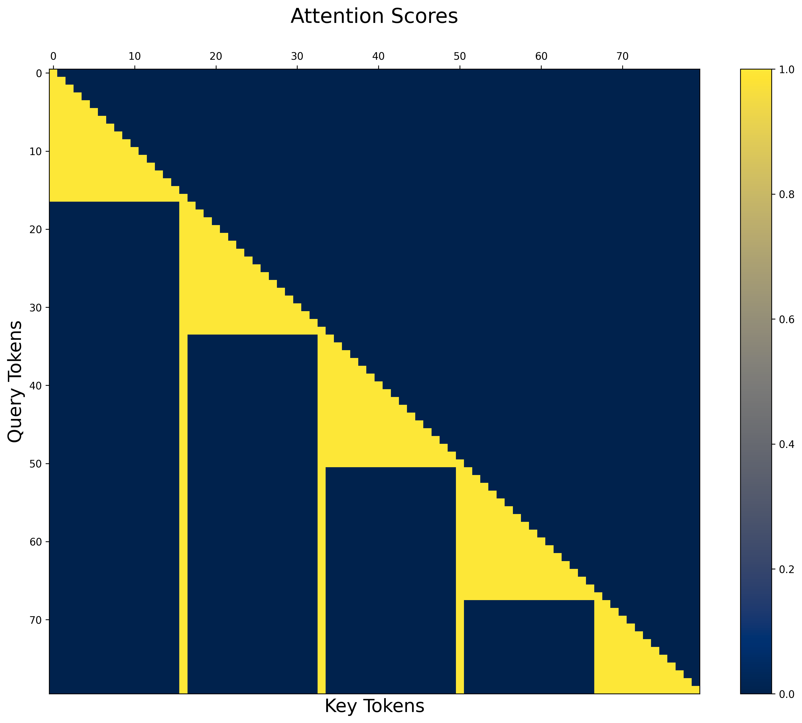

# Reimplement Activation Beacon: Sparse Attention + KV Checkpointing

With the release of `flex_attention` (pytorch), it's easier to implement scalable training for sparse attention
I also want to pretraining the method instead of tuning from instruct model (original work)
Current implementation has some techniques reference to https://github.com/KellerJordan/modded-nanogpt

### Update 1
I successfully run exps on GPT2 architecture. In about 1b tokens, it shows that we can do 16x compress without losing much ppl and 8x compress even achieve better loss convergence.

